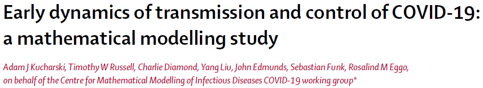
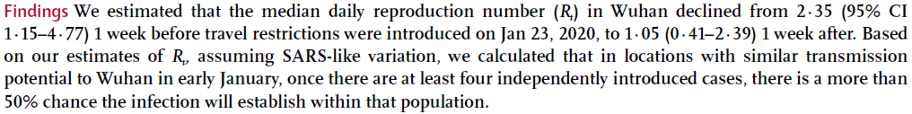
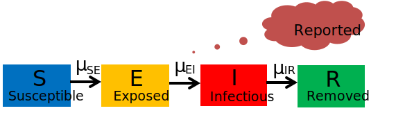

```{r setup, include=FALSE}
knitr::opts_chunk$set(echo = TRUE)
```


### Goals

1. Implementing a differential equation-based $SIR$ model in R

2. Solving the $SIR$ model using numerical integration (deSolve package and Euler)

3. Implement and numerically solve an $SEIR$ model

4. Estimate a model parameter in $SEIR$ model (e.g., $\mathcal{R}_0$)


---

### Session information

1. R version 4.1.0 (2021-05-18)
 
--

2. RStudio Version 1.3.1093

--

3. packages

 - deSolve: numerical integration of ODE's

 - tidyverse: data manipulation and plotting 

 - lubridate: date format
 
 - xaringan: slide generation
 

---
### Implementing an SIR model using differentail equation (DE) framework

- Differential equations (DEs) are commonly used to describe the nature.

- DEs describe rate of change of the variables. 

- Complex DEs don't have analytic solutions and require numerical integration 


---
### SIR model in differential equations

.left[]

- The SIR model in a closed system

$$\begin{aligned} 
\mu_{\bullet S} &= \mu_{S \bullet} = \mu_{I \bullet} = \mu_{R \bullet}=0\\
\mu_{SI} &= \beta \frac{I}{N}\\
\mu_{IR} &= \gamma\\
\frac{dS}{dt} &= - \mu_{SI} S\\
\frac{dI}{dt} &= \mu_{SI} S - \mu_{IR} I\\
\frac{dR}{dt} &= \mu_{IR} I
\end{aligned}$$


---
### R implementation of the SIR model
```{r closed_sir_model}
closed_sir_model <- function(t,  y, params) {
  ## first extract the state variables
  S <- y[1]
  I <- y[2]
  R <- y[3]
  ## now extract the parameters
  beta <- params["beta"]
  gamma <- params["gamma"]
  ## define variables to be consistent with the figure
  N <- S + I + R
  muSI <- beta*I/N
  muIR <- gamma
  ## now code the model equations
  dSdt <- - muSI*S
  dIdt <- muSI*S - muIR*I
  dRdt <- muIR*I
  ## combine results into a single vector
  dydt <- c(dSdt, dIdt, dRdt)
  ## return result as a list!
  list(dydt)
}
```

---
### Model inputs

- Parameters, initial values, simulation times
```{r message=FALSE}
params <- c(beta = 1/2, gamma = 1/5) # model parameters
times <- seq(from = 0, to = 60, by = 1) # simulation times
y0 <- c(S = 999, I = 1, R = 0) # initial values
```
--

- Simulation using the deSolve::ode function 
```{r message=FALSE}
library(deSolve) # numerical integration algorithm for ODE's
library(tidyverse) # data manipulation methods

deSolve::ode(func = closed_sir_model, y = y0, times = times, parms = params) %>%
  as.data.frame() -> out
```

--
Exercise 1: Explain $\beta, \gamma$ in plain language. What are their units? 

---

### Time evolution of S, I, R
```{r echo=FALSE, fig.height=7, fig.align="center"}
theme_set(theme_bw(base_size = 16))
out %>%
  gather(state, value, -time) %>% # wide to long format data
  ggplot(aes(x = time, y = value, color = state)) +
  geom_line(size = 1.5) +
  labs(x = 'Time (day)', y = 'Number of individuals')
```

---
### Euler method to solve the SIR model

```{r closed_sir_model_euler}
closed_sir_model_euler <- function(tend, y0, params, dt = 0.1) {
  ## extract the parameters
  beta <- params["beta"]; gamma <- params["gamma"]; muIR <- gamma
  ## simulation time
  t <- seq(0, tend, dt); iter <- length(t)
  ## variables
  S <- I <- R <- rep(NA, iter)
  ## extract the initial values
  S[1] <- y0["S"]; I[1] <- y0["I"]; R[1] <- y0["R"]  
  ## now code the model equations
  for (i in 2:iter) {
    N <- S[i-1] + I[i-1] + R[i-1]
    muSI <- beta * I[i-1] / N
    dSdt <- - muSI * S[i-1]
    dIdt <- muSI * S[i-1] - muIR * I[i-1]
    dRdt <- muIR * I[i-1]
    S[i] <- S[i-1] + dSdt * dt
    I[i] <- I[i-1] + dIdt * dt
    R[i] <- R[i-1] + dRdt * dt
  }
  return(data.frame(t = t, S = S, I = I, R = R)) ## combine results into a data.frame
}
```

---
### Model parameters, initial values, and simulation times
```{r}
params <- c(beta = 1/2, gamma = 1/5) # model parameters
tend <- 60
dt = 0.1
y0 <- c(S = 999, I = 1, R = 0) # initial values
out_euler <- closed_sir_model_euler(tend = tend, y0 = y0, params = params, dt = dt)
```

---
### Check if simulation results match with deSolve
```{r echo=FALSE, fig.height=7, fig.align="center"}
idx <- seq(1, nrow(out_euler), by = 10) # sample outputs at each day (i.e., dt = 0.1)
out_euler_sub <- out_euler[idx, ]

combined <- data.frame(t = c(out$t, out$t), 
                       I = c(out$I, out_euler_sub$I),
                       method = c(rep("deSolve", 61), rep("Euler", 61)))

combined %>% 
  ggplot(aes(x = t, y = I, color = method)) +
  geom_line(size = 1.2) + 
  theme(legend.title = element_blank()) + 
  labs(x = 'Time (day)', y = 'Number of infecteds')
```


---
## $I$ in response to $\beta,\; \gamma$ 

- $\beta,\; \gamma$ range
```{r}
beta_range <- c(0.2, 0.5, 1)
gamma_range <- 1/c(2, 5, 10)
```

- Simulation
```{r fig.show='hide'}
expand.grid(beta = beta_range, gamma = gamma_range) %>%
  group_by(beta, gamma) %>%
  do({ode(func = closed_sir_model, y = y0, times = times,
          parms = c(beta=.$beta, gamma=.$gamma)) %>%
      as.data.frame()}) %>%
  ggplot(aes(x = time, y = I)) +
  geom_line()+
  facet_grid(beta~gamma, scales = 'free_y', labeller = label_both)
```

- Exercise 2: Select one parameter set (e.g., parameters that lead to $R_0>1$) and conduct numerical integration of $S$, $I$, and $R$

---
### 'manipulate' package
```{r eval=FALSE}
library(manipulate)
tmax <- 60
times <- seq(from = 0, to = tmax, by = 1) # simulation times
y0 <- c(S = 999, I = 1, R = 0) # initial values
beta <- 0.5
gamma <- 0.2
manipulate(
  ode(func = closed_sir_model, y = y0, times = seq(0, tmax, 1),
      parms = c( beta = beta, gamma = gamma)) %>%
  as.data.frame() %>%
  gather(state, value, -time ) %>% # wide to long format data
  ggplot(aes(x = time, y = value, color = state)) +
  geom_line(size = 1.5) +
  labs(x = 'Time (day)', y = 'Number of individuals') +
  theme_bw(base_size = 16),
  beta = slider(0.1, 1),
  gamma = slider(0.1, 1),
  tmax = slider(50, 200))
```
- Exercise 3: Execute the codes above and check how $S, I, R$ change across $\beta$ and $\gamma$
---

class: center, middle

## SEIR model practice 
<br>
### Estimate $\mathcal{R}_0$ using Wuhan data 

---
### Modeling process: Ask questions, collect data

```{r message=FALSE, echo=FALSE, fig.align='center', fig.height=6}
library(ggplot2)
library(extrafont)
loadfonts(device = "win", quiet=TRUE)
x0 <- 15
y0 <- 98
x1 <- 1
x2 <- 40
y1 <- 15
y2 <- 100
fontfam <- "Gill Sans MT"
textsize <- 10
arsize <- 1
data <- data.frame(x=seq(x1,x2,length.out=100), y=seq(y1,y2,length.out=100))
ggplot( data, aes(x, y) )+
  scale_x_continuous(limits=c(x1,x2), minor_breaks = seq(x1, x2, 1)) +
  scale_y_continuous(limits=c(y1,y2), minor_breaks = seq(y1, y2, 1)) +
  annotate('text', x=x0, y=y0, label='Ask questions', size=textsize, family=fontfam, color="darkred" ) +
  annotate('text', x=x0, y=y0-20, label='(Collect data)', size=textsize, family=fontfam, color="darkred"  ) +
  annotate('text', x=x0, y=y0-40, label='Model \n (process & measurement)', size=textsize, family=fontfam) +
  annotate('text', x=x0, y=y0-60, label='Estimate paramters\n (point & interval)', size=textsize, family=fontfam ) +
  annotate('text', x=x0, y=y0-80, label='Answer questions', size=textsize, family=fontfam) +
  geom_segment( x=x0, xend=x0, y=y0-7, yend=y0-13, size=arsize, 
                arrow=arrow(length = unit(0.014, "npc"), type= "closed")) +
  geom_segment( x=x0, xend=x0, y=y0-27, yend=y0-33, size=arsize, 
                arrow=arrow(length = unit(0.014, "npc"), type= "closed")) +
  geom_segment( x=x0, xend=x0, y=y0-47, yend=y0-53, size=arsize, 
                arrow=arrow(length = unit(0.014, "npc"), type= "closed")) +
  geom_segment( x=x0, xend=x0, y=y0-67, yend=y0-73, size=arsize, 
                arrow=arrow(length = unit(0.014, "npc"), type= "closed")) +
  geom_curve( aes(x=x0+8, y=y0-77, xend=x0+8, yend=y0-46), size=arsize, linetype="dashed", 
              arrow=arrow(length=unit(0.014, "npc"), type="closed"))+
  geom_curve( aes(x=x0+8, y=y0-77, xend=x0+8, yend=y0-3), size=arsize, linetype="dashed", 
              arrow=arrow(length=unit(0.014, "npc"), type="closed"))+
  theme_void() +
    theme(plot.margin = margin(-0.8, -2.4, -0.8, -1.2, "cm"), 
         text=element_text(size=16))

```


---
### Modeling procedure: Ask questions, collect data

1. Question: Estimate basic reproduction number, $\mathcal{R}_0$, 
based on the early data from Wuhan

--

2. Data: Following paper

<br>

--
- Findings: $R_0=2.35~[95 \% \text{CI}: 1.15, 4.77]$



---
### Reported daily symptom onset

```{r echo=FALSE, message=FALSE, fig.height=7, fig.align='center'}
# library(lubridate)
# data were p
# read_csv("data/wuhan_covid19.csv") %>%
#   mutate(date = ymd(date), case = case) -> wuhan
wuhan <- structure(list(date = structure(c(18243, 18244, 18245, 18246, 
18247, 18248, 18249, 18250, 18251, 18252, 18253, 18254, 18255, 
18256, 18257, 18258, 18259, 18260, 18261, 18262, 18263, 18264, 
18265, 18266, 18267, 18268, 18269, 18270, 18271, 18272, 18273, 
18274, 18275, 18276, 18277), class = "Date"), case = c(0, 0, 
0, 0, 0, 0, 0, 2, 2, 3, 0, 1, 1, 0, 0, 1, 0, 1, 2, 3, 4, 3, 3, 
1, 2, 5, 6, 8, 3, 8, 8, 5, 17, 7, 13)), class = c("spec_tbl_df", 
"tbl_df", "tbl", "data.frame"), row.names = c(NA, -35L), spec = structure(list(
    cols = list(date = structure(list(format = ""), class = c("collector_date", 
    "collector")), case = structure(list(), class = c("collector_double", 
    "collector"))), default = structure(list(), class = c("collector_guess", 
    "collector")), skip = 1L), class = "col_spec"))

ggplot(data = wuhan) +
  geom_point(aes(date, case)) +
  geom_line(aes(date, case)) +
  theme_bw(base_size = 16) +
  labs(x = "Date", y = "Daily symptom onset of COVID-19 cases")
```

---
### Modeling procedure: modeling
```{r message=FALSE, echo=FALSE, fig.align='center', fig.height=6}
library(ggplot2)
# library(extrafont)
# loadfonts(device = "win", quiet=TRUE)
x0 <- 15
y0 <- 98
x1 <- 1
x2 <- 40
y1 <- 15
y2 <- 100
fontfam <- "Gill Sans MT"
textsize <- 10
arsize <- 1
data <- data.frame(x=seq(x1,x2,length.out=100), y=seq(y1,y2,length.out=100))
ggplot( data, aes(x, y) )+
  scale_x_continuous(limits=c(x1,x2), minor_breaks = seq(x1, x2, 1)) +
  scale_y_continuous(limits=c(y1,y2), minor_breaks = seq(y1, y2, 1)) +
  annotate('text', x=x0, y=y0, label='Ask questions', size=textsize, family=fontfam ) +
  annotate('text', x=x0, y=y0-20, label='(Collect data)', size=textsize, family=fontfam ) +
  annotate('text', x=x0, y=y0-40, label='Model \n (process & measurement)', size=textsize, family=fontfam, color="darkred" ) +
  annotate('text', x=x0, y=y0-60, label='Estimate paramters\n (point & interval)', size=textsize, family=fontfam ) +
  annotate('text', x=x0, y=y0-80, label='Answer questions', size=textsize, family=fontfam) +
  geom_segment( x=x0, xend=x0, y=y0-7, yend=y0-13, size=arsize, 
                arrow=arrow(length = unit(0.014, "npc"), type= "closed")) +
  geom_segment( x=x0, xend=x0, y=y0-27, yend=y0-33, size=arsize, 
                arrow=arrow(length = unit(0.014, "npc"), type= "closed")) +
  geom_segment( x=x0, xend=x0, y=y0-47, yend=y0-53, size=arsize, 
                arrow=arrow(length = unit(0.014, "npc"), type= "closed")) +
  geom_segment( x=x0, xend=x0, y=y0-67, yend=y0-73, size=arsize, 
                arrow=arrow(length = unit(0.014, "npc"), type= "closed")) +
  geom_curve( aes(x=x0+8, y=y0-77, xend=x0+8, yend=y0-46), size=arsize, linetype="dashed", 
              arrow=arrow(length=unit(0.014, "npc"), type="closed"))+
  geom_curve( aes(x=x0+8, y=y0-77, xend=x0+8, yend=y0-3), size=arsize, linetype="dashed", 
              arrow=arrow(length=unit(0.014, "npc"), type="closed"))+
  theme_void()+  
  theme( plot.margin = margin(-0.8, -2.4, -0.8, -1.2, "cm"), 
         text=element_text(size=16))
```

---
### Modeling the COVID-19 transmission using the SEIR framework 
.right[]
```{r}
seir <- function(t, y, params) {
  S <- y[1]; E <- y[2]; I <- y[3]; R <- y[4]; C <- y[5]
  beta <- params["beta"]
  sigma <- params["sigma"]
  gamma <- params["gamma"]
  
  muSE <- beta * I / (S + E + I + R)
  muEI <- sigma
  muIR <- gamma
  
  dS <- - muSE*S
  dE <-  muSE*S - muEI*E
  dI <-  muEI*E - muIR*I
  dR <-  muIR*I
  dC <-  muEI*E ## cumulative symtom onset
  
  return(list(c(dS, dE, dI, dR, dC)))
}

```
---
### Model inputs

- Parameters, initial values, simulation times
```{r}
y0 <- c(S = 11e6 - 1, E = 0, I = 1, R = 0, C = 1) # initial values
params <- c(beta = 2.5/4.5, sigma = 1/5.2, gamma = 1/4.5)
times <- seq(from = 0, to = 35, by = 1)
```
Exercise 4: What does $1/\sigma$ represent?

- Simulation

```{r}
library(deSolve)
daily_case <- function( params ){ 
   ode(y = y0, times = times, func = seir, parms = params) %>% 
   as.data.frame() -> x 
   n <- nrow(x)
   x[2:n,"C"] - x[1:(n-1),"C"]
} 
```
Exercise 5: What is the function 'daily_case' for?

---
### $E, I, R, Y$ over time
- Daily symptom onset, $Y$
```{r echo=FALSE, fig.align='center'}
ode(y = y0, times = times, func = seir, parms = params) %>% 
   as.data.frame() -> out 
n <- nrow(out)
out$Y <- c(out[1, "C"], out[2:n, "C"] - out[1:(n-1), "C"])
out %>%
  gather(state, value, -time) %>%
  filter(state !="S", state != "C") %>%
  ggplot(aes(x = time, y = value, color = state))+
  geom_line()+
  geom_point()+
  labs(x='Time (day)', y = 'Number of individuals') +
  theme_bw(base_size = 16)
```


---
###  $\mathcal{R}_0$ vs. daily symptom onset $Y$
- $\mathcal{R}_0 = \beta/\gamma$. Vary $\beta$ while keeping $\gamma$ constant

```{r}
beta <- seq(from = 0.1, to = 1, by = 0.05)
```

```{r echo=FALSE, message=FALSE, warning=FALSE, fig.height=5}
res <- expand.grid(time = wuhan$date, beta = beta)
res$Y <- do.call(c, lapply( beta, function(x) 
  daily_case(params = c(beta = x, sigma = 1/5.2, gamma = 1/4.5))))

res %>%
  ggplot(aes(x = time, y = Y, group = beta)) +
  geom_line(alpha = 0.2, size = 1) +
  geom_point(data = wuhan, aes(x = date, y = case), size = 1.5, inherit.aes = FALSE)+
  labs(x='Date', y='Daily symptom onset') +
  scale_y_continuous(limits = c(0, 30)) +
  theme_bw(base_size = 16)
```

---
### Measurement error modeling
- Poisson distribution
$$y_t \sim \text{Poisson}(Y_t)$$

$$\mathcal{L}(\theta) = \prod_{t=1}^{n} f(y_t \vert \theta) = \prod_{t=1}^{n} \frac{Y_t^{y_t} e^{-Y_t}}{y_t!}$$

```{r echo=FALSE, message=FALSE, fig.height=5, fig.align='center'}
model_pred <- daily_case(params)
d <- cbind(wuhan, pred = model_pred)
ggplot(data = d)  +
  geom_point(aes(date, case)) +
  geom_line(aes(date, case)) +
  geom_point(aes(date, pred), color = "darkred") +
  geom_line(aes(date, pred), color = "darkred") +
  geom_segment(aes(x = date, xend = date, y = case, yend = pred), color = "steelblue", linetype = "dashed") +
  theme_bw(base_size = 16) +
  labs(x="Date", y="Daily symptom onset")
```

---
###  Implementing Poisson likelihood

- 'stats::dpois', log = TRUE 

```{r}
poisson_loglik <- function(params) {
  model <- daily_case(params = params)
  sum(dpois(x = wuhan$case, lambda = model, log = TRUE)) # sum of log likelihood
}
```

- Define a function that returns poisson_loglik value for a given par value

```{r}
f2 <- function(par) {
  params <-  c(beta = par[1], sigma = 1/5.2, gamma = 1/4.5)
  poisson_loglik(params)
}
```

---
### Maximize the poisson_loglik: grid search

```{r}
res <- data.frame(beta = seq(from = 0.1, to = 1, by = 0.05))
res$loglik <- sapply(res$beta, f2)
(theta <- res$beta[which.max(res$loglik)])
gamma <- 1/4.5; (R0 <- theta/gamma)
```

Exercise 6: Try different resolutions for 'res'. Do you get the same results?

```{r echo=FALSE, fig.height=3}
ggplot(res)+
  geom_line(aes(beta,loglik) )+
  geom_point(aes(beta,loglik) )+
  theme_bw(base_size = 16) +
  labs(x = expression(beta), y="log likelihood") +
  geom_vline(xintercept = res$beta[which.max(res$loglik)], color = "darkred")
```

---
### Maximize the poisson_loglik: 'stats::optim' 

- Define a function that returns a negative log likelihood 
```{r}
f3 <- function(par) {
  params <-  c(beta = par[1], sigma=1/5.2, gamma = 1/4.5)
  - poisson_loglik(params)
}
```
Exercise 7: Why do we define a negative log likelihood function?

- Optimize

```{r}
fit3 <- optim(f3, par = c(0.1), method = "Brent", lower = 0, upper = 10)
(theta <- fit3$par)
gamma <- 1/4.5; (R0 <- theta/gamma)
```
Exercise 8: Try different 'par'. Do you get the same result?

---
### Estimate parameters: confidence interval

```{r echo=FALSE, fig.show='hide'}
prof_b <- expand.grid(b = seq( 1e-6, 1, length = 100))
prof_b$loglik <- -sapply(prof_b$b, f3)
maxloglik <- - fit3$value
plot(loglik~b, data = prof_b, type = "l", ylim = c(-1000, 0))
abline(v = fit3$par)
abline(h = maxloglik)
```
- 95% confidence interval for $\hat{\theta}$ consists of all the values $\theta^*$ for which
$$\text{log}\mathcal{L}(\hat{\theta}) - \text{log}\mathcal{L}(\theta^*) < 1.92$$

```{r warning=FALSE}
maxloglik <- - fit3$value
prof_b <- expand.grid(b = seq(0.5, 0.65, length = 200))
prof_b$loglik <- -sapply(prof_b$b, f3)
cutoff <- maxloglik - qchisq(p = 0.95, df = 1) / 2
(limits <- range(subset(prof_b, loglik > cutoff)$b))
(R0_interval <- limits/gamma)
```

---
### 95% confidence interval
```{r echo=FALSE, warning=FALSE, fig.height=4.5, fig.align='center'}
ggplot(data = prof_b)+
  geom_line(aes(b, loglik))+
  geom_segment(x = fit3$par, xend = fit3$par, y = min(prof_b$loglik), 
               yend = maxloglik, col = "darkred", linetype = "dotted", size = 1) +
  geom_point(x = fit3$par, y = maxloglik-10+0.1, col = "darkred", size = 4, alpha = 0.5) +
  geom_hline(yintercept=maxloglik, col="darkred", linetype="dotted", size = 1)+
  geom_hline(yintercept=cutoff, col="steelblue", linetype="dotted", size = 1) +
  geom_segment(x = limits[1], xend = limits[2], y = cutoff, yend = cutoff, size = 2,
                arrow = arrow(length = unit(0.014, "npc"), type= "closed", ends = "both"), 
               linejoin = 'mitre', color = "steelblue") +
  annotate('text', x = fit3$par+0.01, y=maxloglik-10+0.3, label='MLE', size=6 ) +
  annotate('text', x = fit3$par, y = cutoff+0.25, label = '95% CI', size = 6) +
  theme_bw(base_size = 16)+
  expand_limits( y=maxloglik+c(-10,0.2) )+
  labs(x=expression(theta),y="Log likelihood") +
  scale_y_continuous(limits = maxloglik + c(-10, 0.2), expand = c(0, 0)) + 
  scale_x_continuous(limits = c(0.5,0.65), expand = c(0, 0)) 
```
<!-- - $\hat{\beta}=0.58\left[0.56,0.60 \right], R_0 = \beta/\gamma = 2.60 \left[2.51,2.69 \right]$ -->

---
### Simulation the model using $\beta_{MLE}$
```{r}
params <- c(beta = fit3$par, sigma = 1/5.2, gamma = 1/4.5)
model_pred <- daily_case(params)
simdat <- replicate(2000, rpois(n=length(model_pred), lambda = model_pred))
quantiles <- apply(simdat, 1, quantile, probs = c(0.025,0.5,0.975))
typical <- sample(ncol(simdat), 1)
```

```{r echo=FALSE, fig.height=5, fig.align='center'}
ggplot(data = cbind(wuhan, t(quantiles), typical=simdat[, typical], 
                    pred = model_pred), aes(x = date)) +
  geom_ribbon(aes(ymin=`2.5%`,ymax=`97.5%`), fill='darkred', alpha=0.4 )+
  geom_line(aes(y=`50%`), color='darkred',  )+
  geom_point(aes(y=wuhan$case), color='black', size=2)+
  geom_line(aes(y=typical),color='blue')+
  geom_line(aes(y=pred), color='steelblue', size=2  )+
  labs(y="Daily onse of symptoms", x = "Time (day)" )+
  theme_bw(base_size = 16)
```
---

class: center, middle

## Estimate parameters for the Shincheonji COVID-19 outbreak
<br>
 
---
### Daegu Shincheonji COVID-19

```{r echo=FALSE, message=FALSE, warning=FALSE, fig.height=7, fig.align='center'}
library(lubridate)
# daegu <- read_csv("data/daegu_covid19.csv")
daegu <- structure(list(date = structure(c(18310, 18311, 18312, 18313, 
18314, 18315, 18316, 18317, 18318, 18319, 18320, 18321, 18322, 
18323, 18324, 18325, 18326, 18327, 18328, 18329, 18330, 18331, 
18332, 18333, 18334, 18335, 18336, 18337, 18338, 18339, 18340, 
18341, 18342, 18343, 18344, 18345, 18346, 18347, 18348, 18349, 
18350, 18351, 18352), class = "Date"), daily_total = c(1, 10, 
23, 45, 70, 148, 155, 58, 178, 340, 297, 741, 514, 512, 520, 
405, 321, 367, 390, 297, 190, 92, 131, 73, 61, 62, 41, 35, 32, 
46, 97, 34, 69, 43, 24, 31, 14, 26, 34, 71, 23, 14, 60), daily_shincheonji = c(1, 
8, 17, 37, 66, 108, 127, 280, 221, NA, NA, NA, NA, NA, NA, NA, 
NA, NA, NA, NA, NA, NA, NA, NA, NA, NA, NA, NA, NA, NA, NA, NA, 
NA, NA, NA, NA, NA, NA, NA, NA, NA, NA, NA), cumulative_total = c(1, 
11, 34, 79, 149, 297, 442, 499, 677, 1017, 1314, 2055, 2569, 
3081, 3601, 4006, 4327, 4694, 5084, 5381, 5571, 5663, 5794, 5867, 
5928, 5990, 6031, 6066, 6098, 6144, 6241, 6275, 6344, 6387, 6411, 
6442, 6456, 6482, 6516, 6587, 6610, 6624, 6684), cumulative_shincheonji = c(1, 
9, 26, 63, 129, 237, 376, 407, 501, NA, NA, 1356, 1877, NA, NA, 
2583, 3013, 3397, 3716, 3882, 4007, NA, NA, 4126, NA, 4359, NA, 
4359, 4363, 4363, 4368, 4369, 4369, 4381, 4383, 4383, 4387, 4391, 
4391, 4400, NA, 4467, 4468)), class = c("spec_tbl_df", "tbl_df", 
"tbl", "data.frame"), row.names = c(NA, -43L), spec = structure(list(
    cols = list(date = structure(list(format = ""), class = c("collector_date", 
    "collector")), daily_total = structure(list(), class = c("collector_double", 
    "collector")), daily_shincheonji = structure(list(), class = c("collector_double", 
    "collector")), cumulative_total = structure(list(), class = c("collector_double", 
    "collector")), cumulative_shincheonji = structure(list(), class = c("collector_double", 
    "collector"))), default = structure(list(), class = c("collector_guess", 
    "collector")), skip = 1L), class = "col_spec"))

nr <- nrow(daegu)
d <- daegu$cumulative_shincheonji[2:nr] - daegu$cumulative_shincheonji[1:(nr-1)]
dat <- data.frame(date = daegu$date, daily_confirmed = c(daegu$cumulative_shincheonji[1],d) )
ggplot(data = dat) +
  geom_point(aes(date, daily_confirmed)) +
  geom_line(aes(date, daily_confirmed)) +
  theme_bw(base_size = 16) +
  labs(x = "Date", y = "Daily confirmed cases") + 
  ggtitle("COVID-19 outbreak in the Shincheonji community")
```

---
### Model inputs
- Daily confirmed cases
```{r}
daily_confirmed <- function(params){
  ode(y = y0, times = times, func = seir, parms = params) %>%
  as.data.frame() -> x
  n <- nrow(x)
  x[2:n, "R"] - x[ 1:(n-1), "R"]
}
```

--

- Parameters, initial values, simulation times
```{r}
y0 <- c(S = 9334-1, E = 0, I = 1, R = 0, C = 0)
times <- seq(0, 43, 1)
R0 <- 4
params <- c(beta = R0/4.5, sigma = 1/5.2, gamma = 1/4.5)
```
Exercise 9: Examine the 'daily_confirmed' function and params. 
How long is the average delay from symtom onset to confirmation?
---
### Maximize log likelihood
- negative log likelihood 
```{r}
negloglik <- function(params) {
  p <-  c(beta = params[1], sigma = 1/5.2, gamma = 1/4.5)
  model <- daily_confirmed(params = p)
  d <- data.frame( data=dat$daily_confirmed, model = model)
  d <- d[complete.cases(d), ] # remove rows with missing values for the data or model predicted values
  - sum(dpois(x=d$data, lambda = d$model, log = TRUE))
}
```
--
- 'stats::optim' 
```{r}
fit5 <- optim(par = c(0.5), fn = negloglik,  method = "Brent", lower = 0, upper = 10)
fit5$par; gamma <- 1/ 4.5 # 1/gamma = infectious period
(R0 <- fit5$par/gamma) ##
```

---
### Comparing model prediction with data

```{r echo=FALSE, message=FALSE, warning=FALSE, fig.height=6, fig.align='center'}
model_pred <- daily_confirmed(params = c(beta = fit5$par, sigma = 1/5.2, gamma = 1/4.5))
d <- cbind(dat, pred = model_pred)
ggplot(data = d) +
  geom_point(aes(date, daily_confirmed)) +
  geom_line(aes(date, daily_confirmed)) +
  geom_point(aes(date, pred), color = "red") +
  geom_line(aes(date, pred), color = "darkred") +
  theme_bw(base_size = 16) +
  labs(x = "Date", y = "Daily confirmed cases") + 
  ggtitle("COVID-19 outbreak in the Shincheonji community")
```

---
### Estimate two paramters: $\beta$ and initial infecteds

- Define the negative log likelihood function
```{r}
negloglik2 <- function(params) {
  p <- c(beta = params[1], sigma = 1/5.2, gamma = 1/4.5)
  y0 <- c(S = 9334 - params[2], E = 0, I = params[2], R = 0, C = 0)
  
  model <- daily_confirmed(params = p)
  d <- data.frame(data = dat$daily_confirmed, model = model)
  d <- d[complete.cases(d), ]
  - sum(dpois(x = d$data, lambda = d$model, log = TRUE))
}
```


---
### 'stats::optim'
```{r}
fit6 <- optim(par = c(1e-3, 20), fn = negloglik2)
(theta <- fit6$par)
gamma <- 1 / 4.5 # 1/gamma = infectious period
(R0 <- theta[1]/gamma)
```

---
### Comparing model prediction with data

```{r echo=FALSE, warning=FALSE}
y0 <- c(S = 9334 - theta[2], E = 0, I = theta[2], R = 0, C = 0)
model_pred <- daily_confirmed(params = c(beta=theta[1], sigma=1/5.2, gamma = 1/4.5))
d <- cbind(dat, pred=model_pred)
ggplot(data = d) +
  geom_point(aes(date, daily_confirmed)) +
  geom_line(aes(date, daily_confirmed)) +
  geom_point(aes(date, pred), color="red") +
  geom_line(aes(date, pred), color="darkred") +
  theme_bw(base_size = 16) +
  labs(x = "Date", y = "Daily confirmed cases") + 
  ggtitle("COVID-19 outbreak in the Shincheonji community")
```
---
### Estimate parameters: $\beta$, $\gamma$, and initial infecteds   
- Define the negative log likelihood function 
```{r}
negloglik3 <- function(params) {
  p <-  c(beta = params[1], sigma = 1/5.2, gamma = params[2])
  y0 <- c(S = 9334 - params[3], E = 0, I = params[3], R = 0, C = 0)
  
  model <- daily_confirmed(params = p)
  d <- data.frame(data=dat$daily_confirmed, model = model)
  d <- d[complete.cases(d), ]
  - sum(dpois(x = d$data, lambda = d$model, log=TRUE))
}
```

- 'stats::optim'
```{r eval=FALSE}
fit8 <- optim(par = c(3, 0.5, 20), fn = negloglik3)
(theta <- exp(fit8$par))
(R0 <- theta[1]/theta[2])
```
Exercise 10: Execute the fit8. Are parameter values reasonable? Why do we 
get NaN?
---

### Estimate parameters 2: Only positive values!
- negative log likelihood
```{r}
negloglik4 <- function(params) {
  p <-  c(beta = exp(params[1]), sigma=1/5.2, gamma = exp(params[2]))
  y0 <- c(S=9334-params[3], E = 0, I = exp(params[3]), R = 0, C = 0)
  
  model <- daily_confirmed(params = p)
  d <- data.frame(data = dat$daily_confirmed, model = model)
  d <- d[complete.cases(d), ]
  - sum(dpois(x = d$data, lambda = d$model, log = TRUE))
}
```

---
### 'stats::optim'
```{r}
fit9 <- optim(par = c(log(2), log(0.4), log(50)), fn = negloglik4)
(theta <- exp(fit9$par))
(R0 <- theta[1]/theta[2])
```

---
### Comparing model predictions with data

```{r, echo=FALSE, warning=FALSE, fig.height=6}
y0 <- c(S = 9334 - theta[3], E = 0, I = theta[3], R = 0, C = 0)
model_pred <- daily_confirmed(params = c(beta = theta[1],
                                         sigma=1/5.2, gamma = theta[2]))
# pred <- rpois( length(model_pred), lambda=model_pred )
d <- cbind(dat, pred = model_pred)
ggplot(data = d) +
  geom_point(aes(date, daily_confirmed)) +
  geom_line(aes(date, daily_confirmed)) +
  geom_point(aes(date, pred), color = "darkred") +
  geom_line(aes(date, pred), color = "darkred") +
  # geom_segment( aes(x=date, xend=date, y=daily_confirmed, yend=pred), color="blue", linetype = "dashed") +
  theme_bw(base_size = 16) +
  labs(x = "Date", y = "Daily confirmed cases") + 
  ggtitle("COVID-19 outbreak in the Shincheonji community")
```

Exercise 11: Try different initial values for fit9. Did you get the same results?

Exercise 12: Do you think that parameter values are reasonable?

---
### Summary

1. Implementing differential equation-based $SIR$, $SEIR$ model in R

2. Numerical integration of the model to obtain $S,E,I,R$ (deSolve package and Euler)

3. Estimating parameters based on the 'process' and 'measurement' concepts.

4. Implementing log likelihood function and maximizing the log likelihood function using 
the stats::optim function

5. Applying scientific investigation process and estimating multiple parameters.

---
### Remaining questions 

- How could we improve the model for Shincheonji outbreak?
   
   - Can we assume that rate of isolation increased over time?

--

- Which one would you choose for the model with 1 parameter vs. the one with 3
parameters?
--

- How do you calculate confidence intervals for multiple parameters?

--

- Are there other algorithms for maximizing log likelihood than stats::optim?

